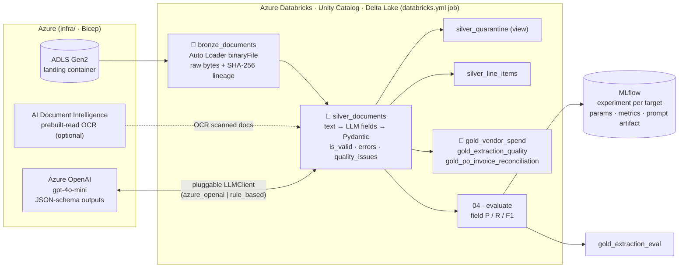

# Document Intelligence Lakehouse on Azure Databricks

[](https://github.com/alimirabrar/azure-databricks-docintel-lakehouse/actions/workflows/ci.yml)


[](LICENSE)

> **Turn piles of invoices, purchase orders and contracts into validated, queryable Delta tables:
> OCR → Azure OpenAI structured extraction → Pydantic validation → analytics, with every prompt
> version's field-level accuracy tracked in MLflow.**

**On the labeled sample in this repo (24 synthetic docs, some with OCR noise), the offline
baseline extractor gets 0.945 micro-F1 over 11 header fields (precision 0.965 / recall 0.925)
and 0.929 F1 on line items.** All 24 records pass schema validation, and 15 of 24 are
extracted with every field correct. Every number here comes from `make run`, which CI also
runs on each push ([see below](#sample-results)).



## The problem

Finance and procurement teams receive thousands of semi-structured documents in different
layouts. Rules-based OCR templates break on every new vendor format. LLMs handle the variety,
but on their own they bring new problems: output that isn't validated, costs you can't see,
silent regressions when someone edits a prompt, and no record of which model or prompt
produced a given number.

## The solution

A **medallion lakehouse** where the LLM is one replaceable step inside a governed data pipeline:

| Layer | What happens | Why it matters |
|---|---|---|
| **Bronze** | Auto Loader ingests raw files as bytes along with path, size, mtime, SHA-256 and the run id | You can always replay the raw documents. Content hashing deduplicates files and makes re-runs idempotent |
| **Silver** | Text extraction (plain text / OCR JSON / PDF / Azure Document Intelligence), then **structured extraction** through a pluggable `LLMClient`, then **Pydantic validation** and business-rule checks | Bad records are quarantined, not dropped. Each row carries `prompt_version`, `llm_client` and `llm_model`. Only *new* hashes are sent to the LLM, so you don't pay for the same tokens twice |
| **Gold** | Vendor spend, extraction-quality KPIs (validity, review-flag and per-field fill rates by prompt version), invoice→PO reconciliation | Gives BI and accounts payable tables they can use, plus an ongoing view of extraction quality |
| **Eval + MLflow** | Field-level precision/recall/F1 against a labeled set, logged together with the prompt text | You can compare prompt and model versions before promoting one |

## Features

- **Pluggable LLM client.** `AzureOpenAIClient` uses JSON-schema structured outputs (built
  from the Pydantic model), `temperature=0` and retry with backoff. Auth is by API key or
  Entra ID (`DefaultAzureCredential`). `RuleBasedClient` is a deterministic regex baseline,
  so the pipeline, tests and CI all run **without credentials**.
- **A single Pydantic schema** (`DocumentExtraction`) for invoices, POs and contracts. It
  coerces types (ISO dates, `Decimal` money, ISO-4217 currency), and
  `consistency_issues()` flags `subtotal + tax ≠ total`, line-item sum mismatches,
  `qty × price ≠ amount`, due dates before issue dates and missing vendors.
- **Versioned prompts** (`v1`, `v2`) stored on each silver row and logged to MLflow as artifacts.
- **Evaluation done properly.** A wrong value counts as both an FP and an FN. Hallucinated
  values count as FPs. Line items are matched as a multiset. Invalid records count as
  empty predictions. Results include per-document error lists.
- **PySpark transforms as plain, testable functions** (`to_bronze`, `to_silver`,
  `vendor_spend`, ...). The same code runs in Databricks notebooks and in local pytest.
- **Ready for Databricks:** an Asset Bundle with a 4-task job (bronze → silver → gold ‖ eval)
  on DBR 15.4 LTS, a wheel artifact, dev/prod targets, secret-scope wiring for prod and a
  paused nightly schedule.
- **Azure IaC (Bicep):** ADLS Gen2 (HNS, no public blobs, no shared keys), a Premium
  Databricks workspace with a Unity Catalog access connector and storage RBAC, and Azure
  OpenAI with a `gpt-4o-mini` deployment plus optional Document Intelligence.
- **CI:** ruff lint and format checks, pytest on Python 3.10 and 3.11 with Spark in local
  mode, an end-to-end pipeline run whose eval table goes into the job summary, and a Bicep
  build and lint.
- **Synthetic data only.** A seeded generator produces fictional companies in three invoice
  layouts (IN/US/EU), POs and two-page OCR-JSON contracts, then injects OCR-style noise
  (`0→O`, `1→l`, `:→;`).

## Sample results

Produced by `make run` (`docintel run --client rule_based --prompt-version v2`) on
`data/sample` (12 invoices, 6 POs, 6 contracts; about 35% of documents have injected OCR noise).
Output: `output/eval_report.md`.

| Field | Precision | Recall | F1 | Support |
|---|---:|---:|---:|---:|
| `doc_type` | 1.000 | 1.000 | 1.000 | 24 |
| `document_number` | 0.864 | 0.792 | 0.826 | 24 |
| `vendor_name` | 0.917 | 0.917 | 0.917 | 24 |
| `buyer_name` | 0.917 | 0.917 | 0.917 | 24 |
| `issue_date` | 1.000 | 1.000 | 1.000 | 24 |
| `due_date` | 1.000 | 0.958 | 0.979 | 24 |
| `po_number` | 0.917 | 0.917 | 0.917 | 12 |
| `currency` | 1.000 | 0.958 | 0.979 | 24 |
| `subtotal` | 1.000 | 0.944 | 0.971 | 18 |
| `tax` | 1.000 | 0.944 | 0.971 | 18 |
| `total` | 1.000 | 0.833 | 0.909 | 24 |
| `line_items` | 0.975 | 0.886 | 0.929 | 44 |
| **micro_avg_scalar_fields** | 0.965 | 0.925 | 0.945 | 240 |

Schema-valid rate 1.000 · document exact-match rate 0.625 (15/24).

The gold tables from the same run:
- **Reconciliation:** 5 invoices matched to a PO, 6 reference a PO that isn't in the sample,
  and 1 is flagged `vendor_mismatch`. That one is a real OCR error (`G0lconda`) that the
  2-way match caught.
- **Review queue:** 2 documents flagged (`line_items_sum_ne_subtotal`, `invoice_missing_total`).

**How to read these numbers:** this is a **regex baseline on a small synthetic set**, not a
production benchmark. It doesn't correct OCR errors, which is where nearly all of its misses
come from (`MSA-2O26-003`, `T0tal`), and it ignores the prompt, so `v1` and `v2` score the
same. Its job is to be a reproducible floor. Run the same eval with `--client azure_openai`
to measure an LLM and its prompt versions against it. I haven't published LLM numbers here
because CI has no Azure credentials.

## Quickstart

### Local (no cloud account needed)

Requires Python 3.10+ and Java 17 (for local Spark).

```bash
git clone https://github.com/alimirabrar/azure-databricks-docintel-lakehouse.git
cd azure-databricks-docintel-lakehouse
python -m venv .venv && source .venv/bin/activate
make install        # pip install -e ".[local,dev,pdf]"
make test           # 36 tests, PySpark local mode
make run            # bronze -> silver -> gold (Parquet in output/lakehouse) + eval + MLflow
make mlflow-ui      # browse runs at http://127.0.0.1:5000
```

To try Azure OpenAI locally:

```bash
export AZURE_OPENAI_ENDPOINT=https://<name>.openai.azure.com
export AZURE_OPENAI_API_KEY=...            # or omit and use `az login` (Entra ID)
export AZURE_OPENAI_DEPLOYMENT=gpt-4o-mini
docintel run --client azure_openai --prompt-version v2
```

### Azure + Databricks

```bash
# 1. Infrastructure (storage, Databricks workspace, Azure OpenAI, Document Intelligence)
az group create -n rg-docintel-dev -l centralindia
az deployment group create -g rg-docintel-dev -f infra/main.bicep -p infra/main.bicepparam

# 2. In the workspace: create a UC external location / catalog on the 'lakehouse' container
#    using the access connector, a schema `docintel`, and a volume `landing`.
#    Upload data/sample/raw -> /Volumes/main/docintel/landing/raw
#    and    data/sample/labels -> /Volumes/main/docintel/landing/labels

# 3. Deploy and run the job (dev uses the offline rule-based client)
databricks bundle deploy -t dev
databricks bundle run docintel_medallion -t dev

# 4. Prod: store the Azure OpenAI key in a secret scope, then deploy with the LLM client
databricks secrets create-scope docintel
databricks secrets put-secret docintel azure-openai-api-key
databricks bundle deploy -t prod --var azure_openai_endpoint=https://<name>.openai.azure.com
```

## Project structure

```
├── src/docintel/
│   ├── schemas.py            # Pydantic DocumentExtraction + consistency checks
│   ├── text_extraction.py    # bytes -> text (txt / OCR JSON / PDF / Azure Doc Intelligence)
│   ├── prompts.py            # versioned prompt templates
│   ├── extraction.py         # text + client + prompt -> validated ExtractionResult
│   ├── llm/                  # LLMClient protocol, AzureOpenAIClient, RuleBasedClient
│   ├── pipeline/             # bronze.py · silver.py · gold.py · io.py (UC/Delta or local)
│   ├── evaluation.py         # field-level precision / recall / F1
│   ├── tracking.py           # MLflow logging (params, metrics, prompt + per-doc artifacts)
│   ├── runner.py · cli.py    # `docintel generate | run`
│   └── data_gen.py           # deterministic synthetic documents + labels
├── notebooks/                # Databricks source notebooks: _setup, 01 bronze, 02 silver, 03 gold, 04 eval
├── databricks.yml            # Asset Bundle (wheel artifact, variables, dev/prod targets)
├── resources/docintel_job.yml# 4-task job on a DBR 15.4 LTS job cluster
├── infra/                    # Bicep: main + storage / databricks / ai modules
├── data/sample/              # 24 synthetic raw docs + ground-truth labels
├── tests/                    # pytest (unit + Spark local-mode integration + MLflow)
└── .github/workflows/ci.yml  # lint · test matrix · e2e eval · bicep
```

## Design notes

- **Why one unified schema?** It gives a single silver table and a single quarantine view,
  and the eval code stays the same for every document type. Fields that don't apply are `null`.
- **Why a Python UDF and not `ai_query`?** The client is pluggable and testable offline, and
  Pydantic validation runs next to the call. `repartition(llm_partitions)` limits concurrency
  so Azure OpenAI TPM limits aren't exceeded.
- **Local vs Databricks storage:** local runs write Parquet so tests don't need Delta jars.
  Databricks writes managed Delta tables in Unity Catalog. Both go through `TableTarget`.

## Roadmap

- [ ] Publish LLM eval results (gpt-4o-mini, prompt v1 vs v2) next to the baseline
- [ ] Delta `MERGE` upserts and Change Data Feed from silver to gold
- [ ] Confidence scores and a human-in-the-loop review app for flagged records
- [ ] Token/cost tracking per document in MLflow; prompt registry via MLflow Prompt Engineering
- [ ] Larger synthetic set with scanned-image PDFs through Document Intelligence
- [ ] Terraform variant of `infra/` and a deploy workflow using GitHub OIDC

## Author

**Mir Abrar Ali**: AI Engineer in Hyderabad, working on LLMs, RAG, document intelligence
and Azure OpenAI.

[LinkedIn](https://linkedin.com/in/mir-abrar-ali) · [GitHub](https://github.com/alimirabrar)

## License

[MIT](LICENSE). All sample documents are synthetic. Company names are fictional, and no real
personal or financial data is included.
